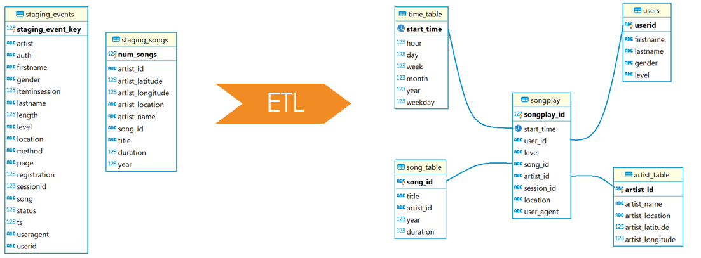
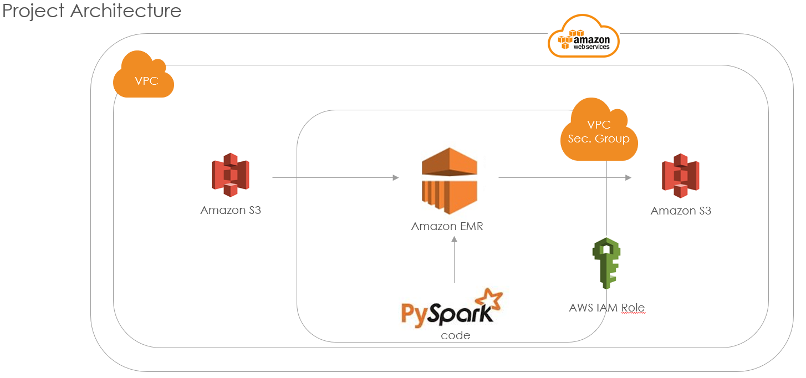
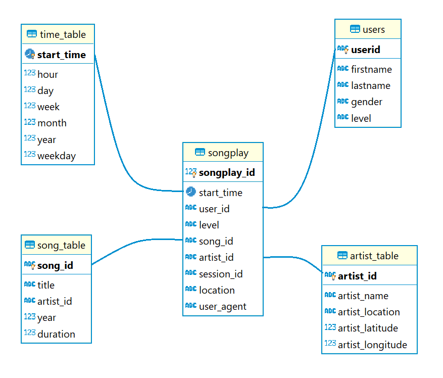

# Data-Lake
Data-Lake is a database for the music streaming startup company Sparkify. The data is a collection of songs and user activities on their new music streaming app. The goal of the program is to understand what songs users are listening to. The information comes from two JSON directories the datasets are in S3 AWS. The program is a database code in PySpark with tables designed to optimize queries on song play analysis and an ETL pipeline.

**ETL explanation**
\
\
**Data Lake Architecture**\
The architecture was made in AWS and consists of a EMR parallelised cluster group. the clusters accesses two S3 folders and loads 2 JSON dataset. From the 2 datasets the dim. and fac. tables are created and loaded in other S3 folder.\
\

## JSON directories (Start Dataset)
**Song Dataset**\
Folder path: 's3://udacity-dend/song_data'\
The first dataset is a subset of real data from the Million Song Dataset. Each file is in JSON format and contains metadata about a song and the artist of that song.\
columns: artist_id, artist_latitude, artist_location,artist_longitude, artist_name, duration, num_songs, song_id, title, year\

**Log Dataset**\
Folder path: 's3://udacity-dend/log_data'\
The second dataset consists of log files in JSON format generated by this event simulator. These simulate activity logs from a music streaming app based on specified configurations.\
columns: artist, auth, firstName, gender, itemInSession, lastName, length, level, location, method, page, registration, sessionId, song, status, ts, userAgent, userId\
It will be only load the row if page = NextSong\

**Dimension Table**\
folder path: 's3a://datalakeeu/'
-Data from Song Dataset (song_table, artist_table)
1) song_table: song_id, title, artist_id, year, duration
2) artist_table: artist_id, artist_name, artist_location, artist_latitude, artist_longitude

-Data from Log Dataset (time_table, users) + page = NextSong
1) time_table: start_time, hour, day, week, month, year, weekday
2) users: userId, firstName, lastName, gender, level

**Fact Table**\
folder path: 's3a://datalakeeu/'
JOIN beteween Song Dataset und Long Dataset (songplay)\
songplay:  songplay_id, start_time, user_id, level, song_id, artist_id, session_id, location, user_agent\

## Program description steps (etl.py)
etl.py is the only skript of this program and create the dimension and fact tables from the two dataset and load the informatio on a S3 folder:

